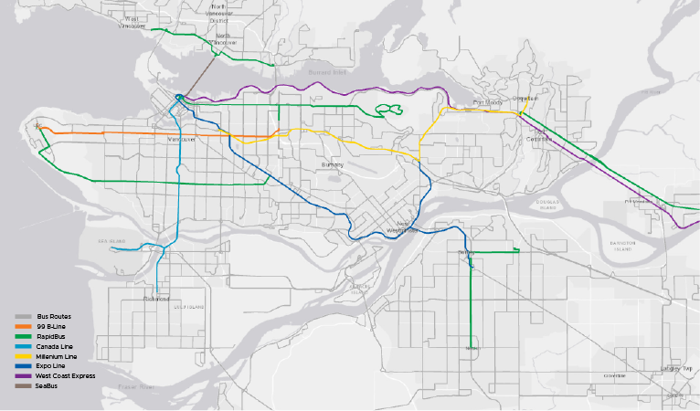

# TransLink Spatial Data

<b>What:</b>   
TransLink is the statutory public transit authority for the Metro Vancouver region. This GitHub repository is a collection of free, public, and ready-for-analysis TransLink GIS datasets that I have created.

<b>Why:</b>  
While individual municipalities within Metro Vancouver have public transit related datasets in their open data portals, there is a lack of publicly available data that covers the entire region and is up to date. TransLink provides [General Transit Feed Specification (GTFS) data](https://developer.translink.ca/servicesgtfs/gtfsdata) on a regular basis but the data format is not very user-friendly, especially for GIS analysis where data formats like shapefiles and GeoJSON are preferred. As a result, I created this data repository to provide updated regional TransLink datasets for use in mapping, analysis, data visualization, and more.

<b>How:</b>  
I converted the TransLink-provided GTFS data to feature classes and shapefiles using the [Public Transit Tools toolbox](https://pro.arcgis.com/en/pro-app/latest/tool-reference/conversion/an-overview-of-the-transit-feed-gtfs-toolset.htm) in ArcGIS Pro. In addition, table join and dissolve operations were performed to preserve data integrity and enhance ease of use. I will provide the Python script tools below for download.
___________________________________________________________________________

  

______________________________________________________________________________
*Datasets are currently based on GTFS data released on July 25, 2022*

### Available Datasets:   

| Dataset | Preview | Download |   
| :------------- | :-------------: | :-------------: |  
| Transit Routes (ALL) | [View](https://github.com/ohenryu/TransLink-Spatial-Data/blob/main/datasets/Transit_Routes_ALL/Transit_Routes_ALL_GeoJSON/Transit_Routes_ALL.geojson) | [.gdb](https://downgit.github.io/#/home?url=https://github.com/ohenryu/TransLink-Spatial-Data/tree/main/datasets/Transit_Routes_ALL/Transit_Routes_ALL_Feature_Class) / [.shp](https://downgit.github.io/#/home?url=https://github.com/ohenryu/TransLink-Spatial-Data/tree/main/datasets/Transit_Routes_ALL/Transit_Routes_ALL_Shapefile) / [.geojson](https://downgit.github.io/#/home?url=https://github.com/ohenryu/TransLink-Spatial-Data/tree/main/datasets/Transit_Routes_ALL/Transit_Routes_ALL_GeoJSON)
| SkyTrain Routes | [View](https://github.com/ohenryu/TransLink-Spatial-Data/blob/main/datasets/SkyTrain_Routes/SkyTrain_Routes_GeoJSON/SkyTrain_Routes.geojson) | [.gdb](https://downgit.github.io/#/home?url=https://github.com/ohenryu/TransLink-Spatial-Data/tree/main/datasets/SkyTrain_Routes/SkyTrain_Routes_Feature_Class) / [.shp](https://downgit.github.io/#/home?url=https://github.com/ohenryu/TransLink-Spatial-Data/tree/main/datasets/SkyTrain_Routes/SkyTrain_Routes_Shapefile) / [.geojson](https://downgit.github.io/#/home?url=https://github.com/ohenryu/TransLink-Spatial-Data/tree/main/datasets/SkyTrain_Routes/SkyTrain_Routes_GeoJSON)
| Bus Routes (ALL) | [View](https://github.com/ohenryu/TransLink-Spatial-Data/blob/main/datasets/Bus_Routes/Bus_Routes_GeoJSON/Bus_Routes.geojson) | [.gdb](https://downgit.github.io/#/home?url=https://github.com/ohenryu/TransLink-Spatial-Data/tree/main/datasets/Bus_Routes/Bus_Routes_Feature_Class) / [.shp](https://downgit.github.io/#/home?url=https://github.com/ohenryu/TransLink-Spatial-Data/tree/main/datasets/Bus_Routes/Bus_Routes_Shapefile) / [.geojson](https://downgit.github.io/#/home?url=https://github.com/ohenryu/TransLink-Spatial-Data/tree/main/datasets/Bus_Routes/Bus_Routes_GeoJSON)
| NightBus Routes | [View](https://github.com/ohenryu/TransLink-Spatial-Data/blob/main/datasets/NightBus_Routes/NightBus_Routes_GeoJSON/NightBus_Routes.geojson) | [.gdb](https://downgit.github.io/#/home?url=https://github.com/ohenryu/TransLink-Spatial-Data/tree/main/datasets/NightBus_Routes/NightBus_Routes_Feature_Class) / [.shp](https://downgit.github.io/#/home?url=https://github.com/ohenryu/TransLink-Spatial-Data/tree/main/datasets/NightBus_Routes/NightBus_Routes_Shapefile) / [.geojson](https://downgit.github.io/#/home?url=https://github.com/ohenryu/TransLink-Spatial-Data/tree/main/datasets/NightBus_Routes/NightBus_Routes_GeoJSON)
| Rapid Transit Routes | [View](https://github.com/ohenryu/TransLink-Spatial-Data/blob/main/datasets/Rapid_Transit_Routes/Rapid_Transit_Routes_GeoJSON/Rapid_Transit_Routes.geojson) | [.gdb](https://downgit.github.io/#/home?url=https://github.com/ohenryu/TransLink-Spatial-Data/tree/main/datasets/Rapid_Transit_Routes/Rapid_Transit_Routes_Feature_Class) / [.shp](https://downgit.github.io/#/home?url=https://github.com/ohenryu/TransLink-Spatial-Data/tree/main/datasets/Rapid_Transit_Routes/Rapid_Transit_Routes_Shapefile) / [.geojson](https://downgit.github.io/#/home?url=https://github.com/ohenryu/TransLink-Spatial-Data/tree/main/datasets/Rapid_Transit_Routes/Rapid_Transit_Routes_GeoJSON)  

### In Progress:
* Transit Stations (all)  
* Bus Exchanges  
* SkyTrain Stations   
* Bus Stations  
* Transit Frequency  

### Script Tools:

* [GTFS_Shape_to_FC.py](script_tools/GTFS_Shape_to_FC.py)

### Other:
* [Hex color codes for major routes](other/route_colors.txt)
